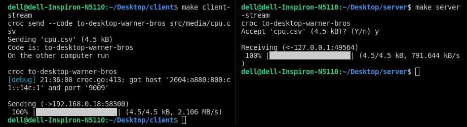

### SniffOps
High-performance agent to stream OS metrics to gRPC server and perform time series forecasting

### Setup client
```sh
  git clone https://github.com/Sai-Adarsh/sniffops
  cd sniffops/client
  make install
```

### Setup server
```sh
  cd sniffops/server
  make install
```

### Logging client
```sh
  cd sniffops/client
  make run
```

### Stop logging server
```sh
  cd sniffops/server
  make stop
```

### Stream logs client
```sh
  cd sniffops/client
  make client-stream
```

### Stream logs server
```sh
  cd sniffops/server
  make server-stream
```

<p align="center">
  
</p>


### Current metrics:
  - [x] CPU
  - [x] Memory
  - [ ] Loadavg
  - [ ] Uptime
  - [ ] Network
  - [ ] Disk I/O

### Deliverables :
  - [x] Logging & monitoring
  - [x] Stream logs to server
  - [ ] Real-time forecasting

### Current binaries:
  - [x] Linux
  - [ ] Windows

### Authors
* Sai Adarsh S
